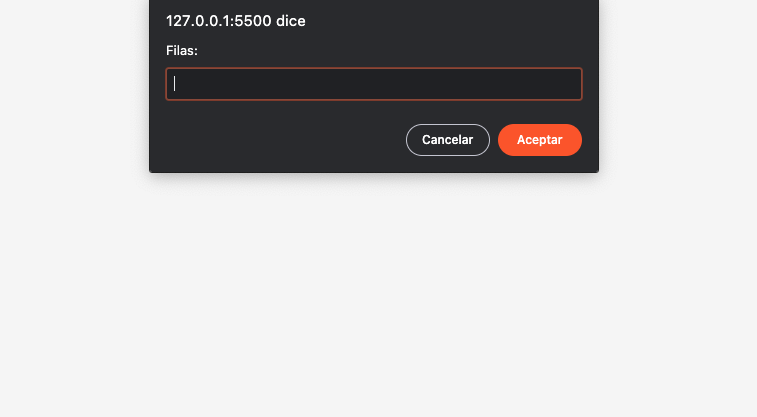
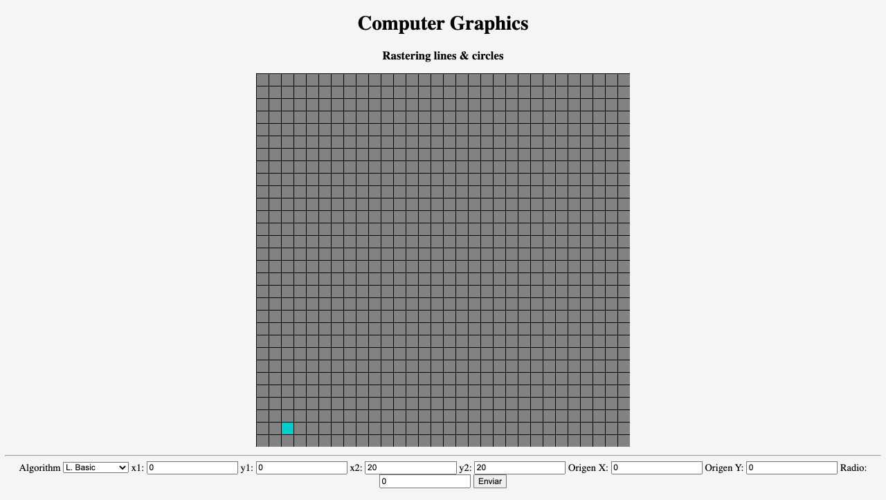
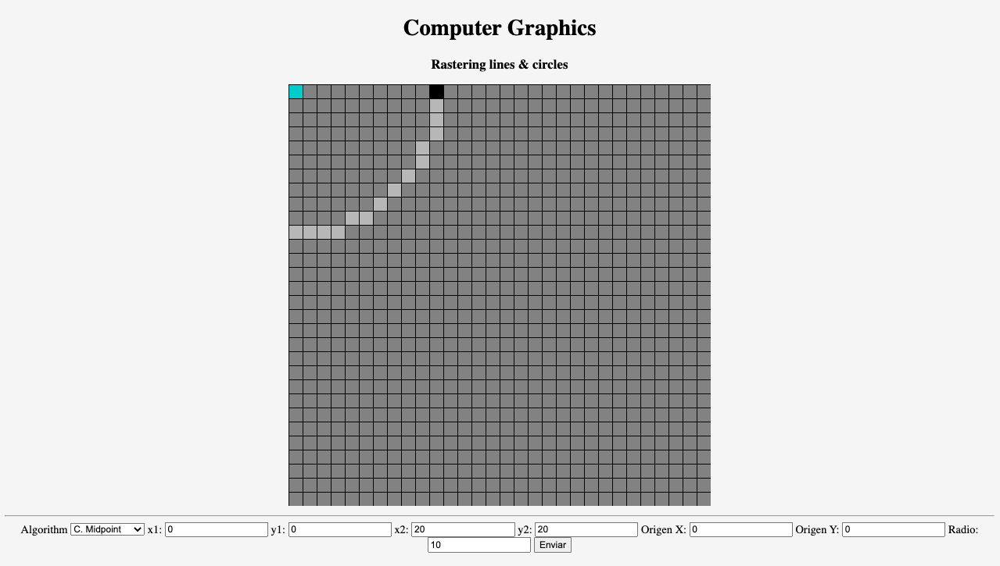
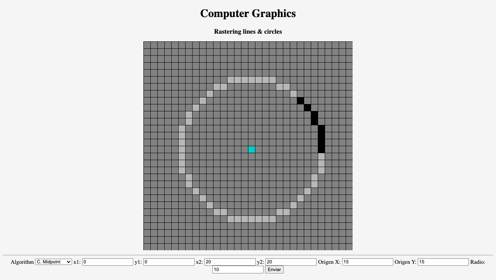

## Getting started

Install dependencies:

```
$ npm i
```
Use VSCode and debug index.html
___

## Actividad 4.1

La implementación de los algoritmos vistos en clase se encuentra [aquí](https://github.com/timetravel-1010/computer-graphics/blob/main/02-rastering/processing/algorithms.js)

___

## Actividad 4.2

Para la ejecución de la aplicación es necesario abrir en el navegador el archivo [index.html](https://github.com/timetravel-1010/computer-graphics/blob/main/02-rastering/processing/index.html). Una vez abierto debería aparecer algo similar a lo mostrado a continuación,



Una vez abierto el archivo, en la parte inferior derecha como se muestra en la imagen de abajo, se encuentran dos **espacios** para ingresar el tamaño del espacio coordenado, un botón desplegable para seleccionar el algoritmo a utilizar y otros espacios ingresar los valores correspondientes de cada coordenada y/o radio según sea el caso. Adicional a esto, el usuario  tiene la posibilidad de establecer el origen del espacio coordenado (0,0) arbitrariamente teniendo en cuenta que, **para esto**, se empieza con un origen (0,0) situado en la **esquina superior izquierda** del espacio coordenado y que los valores de x aumentan hacia la derecha y los de y hacia abajo.



Por ejemplo, si se quiere un espacio 2d de tamaño de 30 filas por 30 columnas se deben ingresar estos valores en las casillas correspondientes y, ahora se puede graficar, por ejemplo, una circunferencia utilizando el algoritmo del punto medio. Para esto, se selecciona el algoritmo en el menú desplegable y a continuación se ingresa el punto correspondiente al centro de la circunferencia y su radio.



En caso de que no se visualice por completo un dibujo se puede proceder a mover el origen del espacio coordenado ingresando nuevos valores para dicho punto.




___

## License

Copyright &copy; 2022 GNU GPLv3. Created by [JAPeTo](https://garatzailea.com.co)