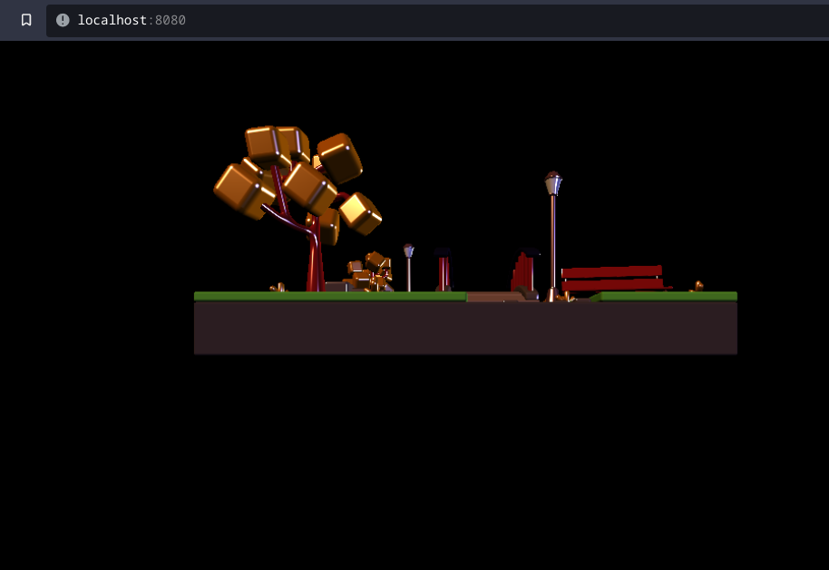
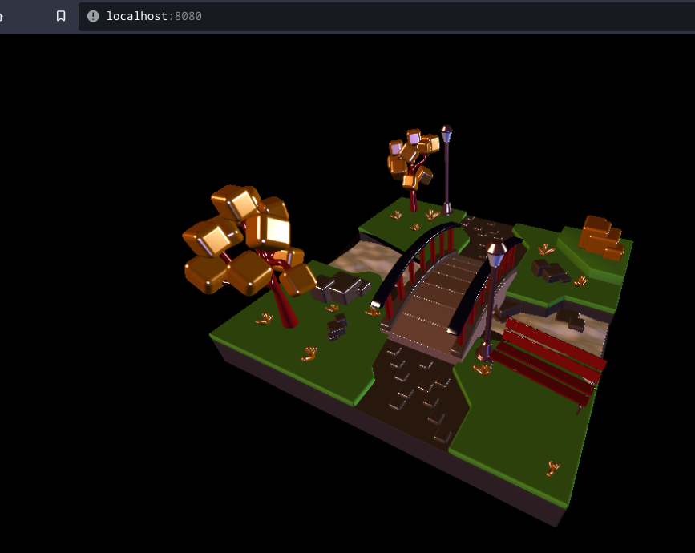
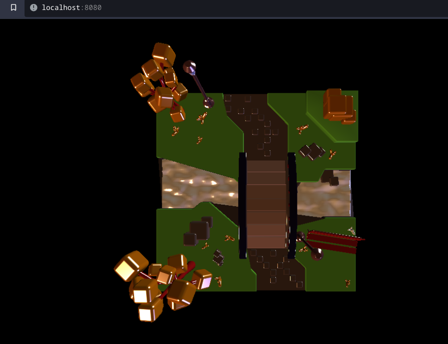
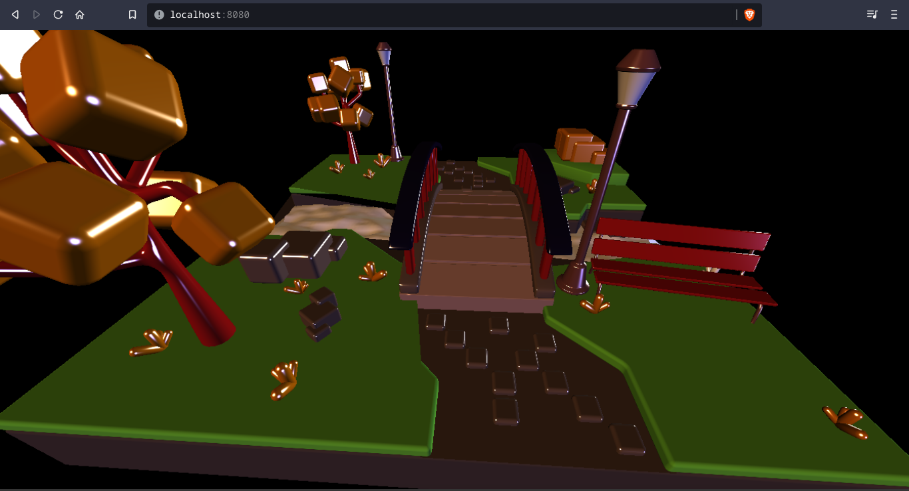
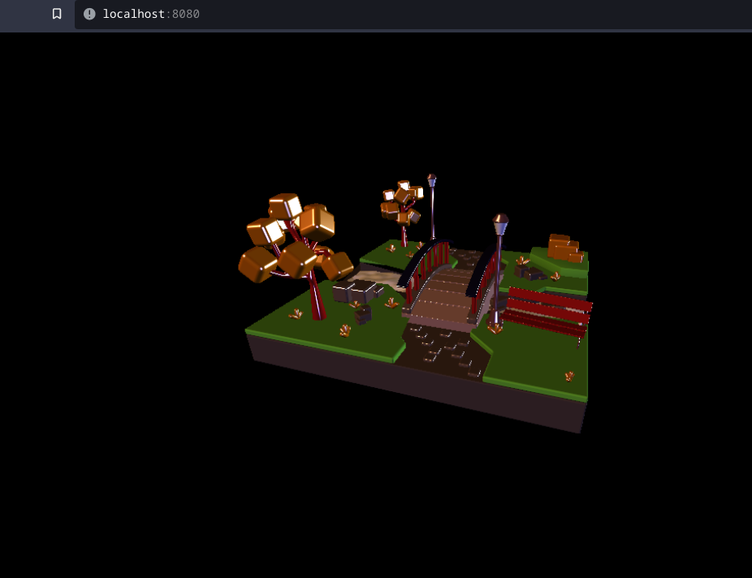

# Instalación de las dependencias

Se ha implementado un servidor simple con express.js para evitar problemas de origen cruzado al ejecutar threeJS.

Estando ubicado dentro de la carpeta de la carpeta [cargar-archivo-obj](https://github.com/timetravel-1010/computer-graphics/tree/main/lab4/actividad-2-1/carga-archivo-obj) se deben ejecutar los siguientes comandos
```bash
$ npm install
$ npm run start
```

Y para visualizar el programa se debe dirigir a http://localhost:8080.


# Capturas de Pantalla del Objeto Cargado

En este caso se cargó el objeto [Sunny Park Scene-3d](https://www.turbosquid.com/es/3d-models/sunny-park-scene-3d-model-1862516), a continuación se muestran las capturas de pantalla de la carga del objeto

## Vista Inicial



## Otras Perspectivas del Objeto







